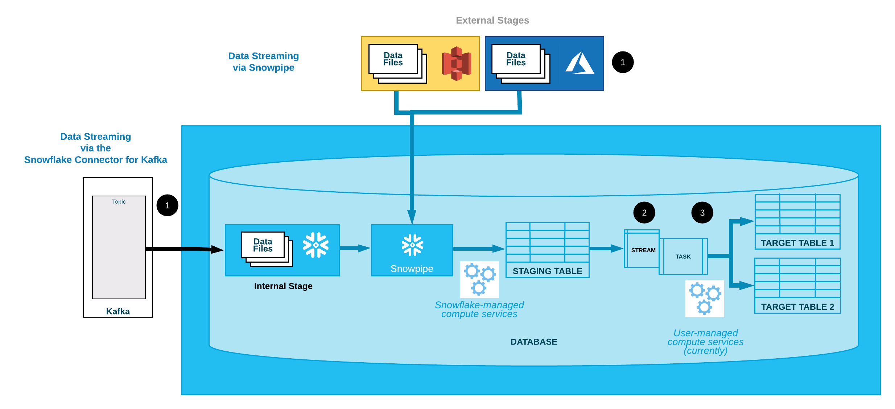

# Continuous Learning Program: Data warehousing - Snowflake

## Table of contents

1. [Context of the module](#context)
2. [Prerequisites](#prerequisites)
2. [Learning Objectives](#learning_objectives)
3. [Content](#content)
4. [Project 1](#project)

## Context of the module 

A Data Warehouse is a component where your data is centralized, organized, and structured according to your organization's needs. It is used for data analysis and BI processes.

Data Warehouses are one of the cornerstones of Data Engineering. They have evolved a lot from their beginnings. From EDW (Enterprise Data Warehouses) up to today's modern Data Warehouses like AWS Redshift, Snowflake, and Bigquery.

This module is meant to give you some hands-on practice on Snowflake and dimensional modeling using a Brazilian E-Commerce Public Dataset.

## Prerequisites 

- SQL
- Understanding of AWS
- Understanding of row oriented databases
- Understanding of column oriented databases

## Learning objectives 

By the end of this module you have learned about:

- Loading & Extracting data from AWS S3
- Loading data into Snowflake using both approaches, batch, and streaming
- Continuous data pipelines with Snowpipe
- Building a dimensional model in a Data Warehouse

## Content 

### Books
- [The Analytics Setup Guidebook (Free)](https://www.holistics.io/books/setup-analytics/)
- [The Data Warehouse Toolkit: The Definitive Guide to Dimensional Modeling, 3rd Edition 3rd Edición](https://www.amazon.com/Data-Warehouse-Toolkit-Definitive-Dimensional/dp/1118530802) (At least first four chapters)

### Blog posts
- [How to architect the perfect Data Warehouse](https://lewisdgavin.medium.com/how-to-architect-the-perfect-data-warehouse-b3af2e01342e)
- [Building a Data Warehouse: Basic Architectural principles](https://towardsdatascience.com/building-a-data-warehouse-basic-architectural-principles-66bd7059ffd0)
- [Data Warehouse Pipeline: Basic Concepts & Roadmap](https://towardsdatascience.com/)
- [Slowly changing dimension](https://en.wikipedia.org/wiki/Slowly_changing_dimension)

### Guides
- [Snowflake - Quick Tour of the Web Interface](https://docs.snowflake.com/en/user-guide/snowflake-manager.html)
- [Snowflake in 20 Minutes](https://docs.snowflake.com/en/user-guide/getting-started-tutorial.html)
- [Hands-on lab guide for Snowflake free trial](https://s3.amazonaws.com/snowflake-workshop-lab/Snowflake_free_trial_LabGuide.pdf)
- [Snowpipe - Continuous Data Pipelines in Snowflake](https://docs.snowflake.com/en/user-guide/data-pipelines.html#continuous-data-pipelines)
- In general, remember to look at the [Snowflake documentation](https://docs.snowflake.com/en/index.html)

### Videos
- [Dimensional Modeling by Bryan Cafferky](https://www.youtube.com/watch?v=lWPiSZf7-uQ)
- [Snowflake Data Management - No Admin Required](https://www.youtube.com/watch?v=_a7LGy1jbRw)

### Courses

It could be a great idea to pursue a certification in Snowflake, you can read more about it [here](https://www.snowflake.com/certifications/). This module is meant to give the basics to achive the Snowpro core certification, so here is more material to prepare for that:

- [Snowpro core certification exam guide](https://training.snowflake.com/SnowProCoreExamGuides?_http_return_to_url=https%3A%2F%2Ftraining.snowflake.com%2Fadmin%2Fpage%2Fview%2F82.html&_ga=2.123762058.1493284945.1639428235-1722244229.1637006112) 
- [Snowpro core study Guide](https://learn.snowflake.com/courses/course-v1:snowflake+SPSG-CORE+A/about)
- [Snowflake Hands on Essentials & Level Up Series](https://learn.snowflake.com/tracks)
- [Free on-demand courses from Snowflake](https://training.snowflake.com/courses?_ga=2.161833148.1460095722.1640203877-678052788.1634311535)
- [Udemy course: Snowflake – The Complete Masterclass](https://www.udemy.com/course/snowflake-masterclass/)

## Project 1 
### Context

In this particular project, you will be working with a Brazilian E-Commerce Public Dataset. Please go through the dataset description on the following [link](https://www.kaggle.com/olistbr/brazilian-ecommerce?select=olist_sellers_dataset.csv) to get more context on what this dataset is about.

This dataset was generously provided by Olist, the largest department store in Brazilian marketplaces. Olist connects small businesses from all over Brazil to channels without the hassle and with a single contract. Those merchants are able to sell their products through the Olist Store and ship them directly to the customers using Olist logistics partners.

For this case, we want to leverage this data as an exercise to simulate a data warehouse creation scenario for insight extraction.

Keep in mind that this data is divided into multiple datasets for better understanding and organization. Please refer to the following data schema when working with it:

Since this data is in a transactional schema you will have to create a dimensional model that fits the business questions presented. Also, you will need to create the transformations on the data following an ELT pattern.

To do so, you will have to learn and use several Snowflake functionalities and capabilities to load data both in batch and in a real-time way. And then transforming the loaded data, in order to feed the dimensional model.

### Scenario

The company wants to answer several questions about their business. To do so, they strongly believe in making data-driven decisions. Your job is to build a dimensional model able to answer the following business questions:

1. Sales report: the management team wants a full picture of how the sales are going. Some of the questions they want to answer are:
   - How are the total sales going per month? 
   - How are the total sales going comparing the current month with the same month for the former year?
   - What are the best-selling products for different price ranges historically?
   - What are the best-selling product categories per month?
   - What are the product categories with the highest review score per month?

2. Customers report: the marketing team wants a full picture of who are the best customers and things in common that they have. Also, they want to know the characteristics of the worst customers. Some of the questions they want to answer are:
   - They want to know who are the best customers and the product categories that they most buy.
   - In which cities are the most sales?
   - What are the most used payment types? Also, what are the payments types that collect the most money?

3. Supply report: the management team wants to know who are the best sellers, the best places to sell, etc so that they can think about growth plans. Some of the questions they want to answer are:
   - Who are the best sellers (vendors) per city?
   - They want to provission better their inventory based on the expected demand so want to see the peak moments each year.
   - Where should they open more stores, supply more?

### Tech Stack and Infrastructure
You will be using the following resources for this project.

- AWS
  - S3
- Snowflake
  - Snowpipe

You are going to follow this architecture, following an ELT pattern, and simulating a continuous data pipeline using Snowpipe.

Remember that:
1. Snowpipe continuously loads micro-batches of data from an external stage location (Amazon S3, Google Cloud Storage, or Microsoft Azure) into a staging table.
2. One or more table streams capture change data and make it available to query.
3. One or more tasks execute SQL statements to transform the change data and move the optimized data sets into destination tables for analysis.

To read more information, please read Snowflake [documentation](https://docs.snowflake.com/en/user-guide/data-pipelines-intro.html#features-included-in-continuous-data-pipelines)

### Instructions
#### Data Sources Configuration

* We've already uploaded the complete Brazilian E-Commerce Public Dataset in the following [bucket](https://s3.console.aws.amazon.com/s3/buckets/factored-clp-de?region=us-east-1&prefix=data-warehouses-snowflake/). Explore the data, structure and format of each of the files before diving in code. You can also refer to the Kaggle documentation.
* Create a bucket named `clp-data-warehouse-snowflake-{your-name}-data-lake`. Then, create two folders inside of it: `raw-zone` and `structured-zone`.

#### Data Extraction
* For the sake of simulating the extraction of data, please go ahead and download all the data that is in this [bucket](https://s3.console.aws.amazon.com/s3/buckets/factored-clp-de?region=us-east-1&prefix=data-warehouses-snowflake/)  and load it in the `raw-zone` of the data lake. Since the purpose of this project is to simulate a continuous data pipeline, this stage will be done by one or more Apache Kafka (or Google PubSub or another similar tool) topics into an internal (Snowflake) stage. Nevertheless, you don't have to worry about that for this project.

#### Data Load and Data Transformation
* Use Snowwpipe to copy the data from `raw-zone` of the data lake to Staging tables in Snowflake. Remember to check out the architecture presented, also, you could follow these [Continuous Data Pipeline Examples](https://docs.snowflake.com/en/user-guide/data-pipelines-examples.html)

* Also, bear in mind that the transformation stage will be done by the `task objects`, here you will create the logic to transform the data into the dimensional model that you created.

* Finally, unload the transform data into the `structured-zone` using task objects as well.

#### Dimensional modeling
* Use Kimball's theory to build a dimensional model to solve business questions proposed on this project
