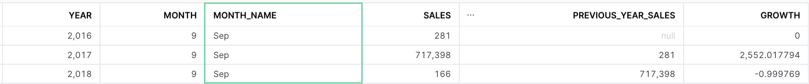

# CLP datwarehousing - Snowflake
## Project context

Using the data provided by Olist, which is in a transactional schema, a dimensional model was created based on Kimball's theory using continuous data pipelines features provided by Snowflake. This dimensional model was required to solve several business questions that I will address later on.

## contents
1. [Create storage integration and external stages](#create-storage-integration-and-external-stages)
2. [Loading data](#loading-data)
3. [Tansforming data](#transforming-data)
    - [Facts and dimensions models design](#facts-and-dimensions-models-design)
    - [Create table streams for change tracking](#create-table-streams-for-change-tracking)
    - [Create transformation tasks for new data coming through streams](#create-transformation-tasks)
4. [Unloading data to S3](#unloading-data-to-s3)
5. [Business analytics](#business-analytics)

## Create storage integration and external stages

The first step to be able to read dara from and write data to an Amazon S3 bucket is to use storage integrations. The bucket will need to be referenced in external stages (one for loading data and another one for unloading data).

These steps were followed to configure the integration and create the stages:

- Create the IAM policy
- Create the IAM role
- [Create the storage integration in snowflake](create_integration.sql)
- Grant the IAM user permissions to access buckets
- [Create the load stage](load_stages_and_pipes.sql)
- [Create the unload stage](unload_stage.sql)

## Loading data

As soon as files are added to the S3 bucket, Snowpipe data loads are triggered using Amazon SQS (Simple Queue Service) notifications for an S3 bucket.

After the storage integration and the load stage are created, the following steps were taken to configure the automated data loading using Snowpipe:

[**Note: before creating the loading pipes, the whole DW structure needs to be created first(databases, schemas and staging tables)**](create_dw_structure.sql)

- [Create pipes with Auto-Ingest Enabled](load_stages_and_pipes.sql)
    - On this step, a pipe was created for each .csv file in the raw zone of the bucket. The pipe will automatically copy all the data from de file into the correspondent staging table
- Configure event notifications for the S3 bucket in AWS

## Transforming data

### Facts and dimensions models design

The first step for transforming the data was to design the [facts](facts_models.sql) and [dimensions](dimensions_models.sql) models. As soon as I was certain about the tables columns and datatypes, I finished creating the DW structure (tables in the STRUCTURED schema)

**fact_order_items:**

**fact_payments:**

**fact_reviews**

### *Note about the location dimension:*

*According to Kimball's theory, we should resist the urge to to "snowflake" dimension tables to favor ease of use and performance.*

*Because of this, I decided to include the location attributes inside the customers and sellers dimensions, instead of creating a whole new dimension table.*

### Create table streams for change tracking

For every table in the STAGING schema, [a stream object was created](create_streams.sql). These objects record changes made to the staging tables, which I will be able to query with my transformation tasks to update the tables in the STRUCTURED schema.

### Create transformation tasks

A transformation task is needed for every table in the STRUCTURED schema ([view code](create_tasks.sql)).

Each task reads the changes that were recorded in streams (the task runs under the condition system$stream_has_data, which indicates whether a specified stream contains change data capture records),  executes an SQL statement that transforms the new data and then merges it into the dimensions or facts tables. Since I won't be handling row deletions, these SQL statements only take into account rows with METADATA$ACTION = 'INSERT'.

## Unloading data to S3

A child task was added to each transformation task, which will read all the tables in the STRUCTURED schema (after the transformation tasks run) and copy them into the structured zone of the S3 bucket, using the unload stage that was created earlier.

The fact_payments and fact_order_items unload tasks were configured so that the data was saved in separate files by year. The rest of the tables were configured to be saved in a single .csv file. ([View code](create_tasks.sql))

## Business analytics

### Sales reports
[View code](sales_report.sql)

- *How are the total sales going per month?*

- *How are the total sales going comparing the current month with the same month for the former year?*

- *What are the best-selling products for different price ranges historically?*

- *What are the best-selling product categories per month?*

- *What are the product categories with the highest review score per month?*

### Customer reports
[View code](customers_report.sql)

- *who are the best customers and the product categories that they most buy*

- *In which cities are the most sales?*

- *What are the most used payment types? Also, what are the payments types that collect the most money?*

### Supply reports
[View code](supply_report.sql)

- *Who are the best sellers per city?*

- *They want to provission better their inventory based on the expected demand so want to see the peak moments each year.*

    - This would be the sales report with the monthly sales per year

- *Where should they open more stores, supply more?*

